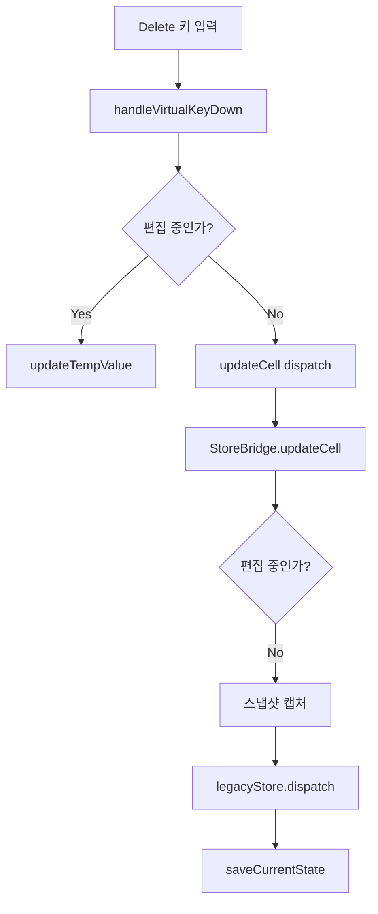

# Undo/Redo Delete 키 이슈 분석 (2025-07-02)

## 🚨 문제 현상
- **시나리오**: 1행의 셀들을 순서대로 `delete - tab - delete - tab - delete - tab` 로 삭제
- **기대**: Ctrl+Z 시 삭제된 순서의 역순으로 값들이 복원
- **실제**: Undo가 작동하지 않음

---

## 🔍 문제 분석

### 1. Delete 키 처리 흐름 추적



### 2. 현재 코드 상태 점검

#### 2.1 StoreBridge.updateCell() 메서드
```javascript
updateCell(payload) {
  if (this.enhancedManager.isEditing()) {
    // 편집 중이면 임시 저장
    this.enhancedManager.updateTempValue(payload.value);
  } else {
    // 편집 중이 아니면 스냅샷 후 즉시 저장
    const { rowIndex, key, value, cellIndex } = payload;
    const beforeValue = (() => {
      const row = this.legacyStore.state.rows[rowIndex];
      if (!row) return undefined;
      if (cellIndex !== null && cellIndex !== undefined) {
        return row[key]?.[cellIndex];
      }
      return row[key];
    })();

    if (beforeValue !== value) {
      this._captureSnapshot('cell_edit', { rowIndex, colKey: key, cellIndex, before: beforeValue, after: value });
    }

    this.legacyStore.dispatch('updateCell', payload);
    this.saveCurrentState();
  }
}
```

#### 2.2 문제점 식별

**문제 1: Delete 키가 "편집 중"으로 인식될 가능성**
- Delete 키 입력 시 `cellInputState.isCurrentlyEditing()` 이 true를 반환하는지 확인 필요
- 편집 중이면 `updateTempValue()` 만 호출되고 실제 저장은 `completeCellEdit()` 에서만 발생

**문제 2: 스냅샷 캡처 시점**
- Delete 키는 "즉시 적용"되어야 하는데, 현재는 편집 완료 시점에만 스냅샷이 저장됨
- 개별 Delete 키 입력마다 스냅샷이 필요

**문제 3: 값 비교 로직**
- `beforeValue !== value` 조건에서 Delete 키로 빈 값('')이 들어올 때 제대로 비교되는지 확인 필요

---

## 🧪 디버깅 체크리스트

### 3.1 콘솔 로그 추가 포인트

```javascript
// StoreBridge.updateCell() 시작
console.log('[DEBUG] updateCell 호출:', { payload, isEditing: this.enhancedManager.isEditing() });

// 스냅샷 캡처 전
console.log('[DEBUG] beforeValue vs value:', { beforeValue, value, willCapture: beforeValue !== value });

// HistoryManager.saveSnapshot() 내부
console.log('[DEBUG] 스냅샷 저장:', { action, meta, stackLength: this.undoStack.length });
```

### 3.2 확인해야 할 상태들

1. **편집 상태 확인**
   ```javascript
   console.log('isEditing:', storeBridge.isEditing());
   console.log('cellInputState:', storeBridge.enhancedManager.cellInputState.getDebugInfo());
   ```

2. **HistoryManager 상태 확인**
   ```javascript
   console.log('undoStack length:', storeBridge.history.undoStack.length);
   console.log('canUndo:', storeBridge.canUndo);
   ```

3. **localStorage 상태 확인**
   ```javascript
   console.log('epidemiology_history:', localStorage.getItem('epidemiology_history'));
   ```

---

## 🔧 해결 방안

### 방안 1: Delete 키를 "즉시 적용" 모드로 처리
```javascript
// handleVirtualKeyDown에서 Delete 키 감지 시
if (event.key === 'Delete' || event.key === 'Backspace') {
  // 편집 상태와 관계없이 즉시 스냅샷 + 저장
  storeBridge.saveCellValue(rowIndex, colIndex, '', columnMeta);
  return;
}
```

### 방안 2: updateCell에서 편집 상태 무시하고 스냅샷
```javascript
updateCell(payload) {
  // 편집 중이어도 Delete/Backspace는 즉시 적용
  if (payload.value === '' && !this.enhancedManager.isEditing()) {
    // 즉시 스냅샷 + 저장
    this._captureSnapshot('cell_delete', payload);
    this.legacyStore.dispatch('updateCell', payload);
    this.saveCurrentState();
    return;
  }
  
  // 기존 로직...
}
```

### 방안 3: 키보드 핸들러에서 직접 처리
```javascript
// useUndoRedo.js에서 Delete 키 별도 처리
const handler = (e) => {
  if (e.key === 'Delete' || e.key === 'Backspace') {
    // 현재 선택된 셀 정보로 즉시 삭제 처리
    // 편집 상태와 무관하게 스냅샷 + 저장
  }
  // 기존 Ctrl+Z/Y 처리...
};
```

---

## 📋 테스트 시나리오

### 기본 테스트
1. 셀 A1에 "test" 입력
2. Delete 키 → 빈 값으로 변경
3. Ctrl+Z → "test" 복원 확인

### 연속 테스트
1. A1: "a", B1: "b", C1: "c" 입력
2. A1 선택 → Delete → Tab → B1 선택 → Delete → Tab → C1 선택 → Delete
3. Ctrl+Z 3회 → c, b, a 순서로 복원 확인

### 편집 모드 테스트
1. 셀 더블클릭 → 편집 모드 진입
2. Delete 키 → 편집 중이지만 즉시 적용되는지 확인
3. Ctrl+Z → 복원 확인

---

## 🎯 우선순위

1. **즉시**: 콘솔 로그 추가로 현재 상태 파악
2. **단기**: Delete 키 즉시 적용 로직 구현
3. **중기**: 모든 키보드 단축키 일관성 확보
4. **장기**: 편집 모드와 즉시 적용 모드 구분 명확화

---

## 📝 다음 단계

1. 콘솔 로그 추가하여 현재 흐름 파악
2. Delete 키 처리 로직 수정
3. 테스트 시나리오 실행
4. 결과 검증 및 추가 수정

> 작성자: AI 코파일럿 (2025-07-02)  
> 상태: 분석 완료, 해결 방안 제시 