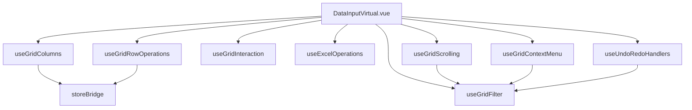

# DataInputVirtual.vue 리팩토링 문서

## 📊 개요

| 항목 | Before | After | 변화 |
|------|--------|-------|------|
| 파일 크기 | ~3000줄 | ~806줄 | **-73%** |
| Composables | 0개 | 8개 | +8 |
| 유지보수성 | 낮음 | 높음 | ⬆️ |

---

## 📁 디렉토리 구조

```
src/components/DataInputVirtualScroll/
├── DataInputVirtual.vue          # 메인 컴포넌트 (~806줄)
├── composables/
│   ├── useGridColumns.js         # 컬럼 메타데이터
│   ├── useGridScrolling.js       # 가상 스크롤
│   ├── useGridFilter.js          # 필터링
│   ├── useGridInteraction.js     # 사용자 인터랙션
│   ├── useExcelOperations.js     # 엑셀 처리
│   ├── useGridContextMenu.js     # 컨텍스트 메뉴
│   ├── useGridRowOperations.js   # 행 추가/삭제
│   ├── useUndoRedoHandlers.js    # Undo/Redo
│   └── useDateTimePicker.js      # 데이트피커 (미적용)
├── handlers/
├── logic/
├── parts/
└── utils/
```

---

## 🧩 Composables 상세

### 1. useGridColumns.js
**역할**: 컬럼 메타데이터 및 헤더 그룹 관리

```javascript
const { 
  allColumnsMeta,      // 전체 컬럼 메타 (computed)
  headerGroups,        // 헤더 그룹 (computed)
  tableWidth,          // 테이블 너비 (computed)
  onAddColumn,         // 컬럼 추가
  onDeleteColumn,      // 컬럼 삭제
  onToggleExposureColumn,
  onToggleConfirmedCaseColumn,
  onDeleteEmptyCols,
  onResetSheet
} = useGridColumns(store, storeBridge, validationManager, selectionSystem, focusGrid);
```

---

### 2. useGridScrolling.js
**역할**: 가상 스크롤 및 뷰포트 관리

```javascript
const {
  gridContainerRef,    // 그리드 컨테이너 ref
  gridHeaderRef,       // 헤더 ref
  gridBodyRef,         // 바디 ref
  visibleRows,         // 화면에 보이는 행
  totalHeight,         // 전체 높이
  paddingTop,          // 상단 패딩
  scrollbarWidth,      // 스크롤바 너비
  handleGridScroll,    // 스크롤 핸들러
  ensureCellIsVisible  // 셀 가시성 보장
} = useGridScrolling(filteredRows, allColumnsMeta, { rowHeight: 35, bufferSize: 1 });
```

---

### 3. useGridFilter.js
**역할**: 필터 상태 및 필터링 로직

```javascript
const {
  filterState,                    // 필터 상태
  filteredRows,                   // 필터된 행
  computedActiveFilters,          // 활성 필터
  onUpdateActiveFilters,          // 필터 업데이트
  onClearAllFilters,              // 전체 필터 해제
  syncFilterStateAfterHistoryChange,
  captureSnapshotWithFilter
} = useGridFilter(storeBridge, store, rows);
```

---

### 4. useGridInteraction.js
**역할**: 마우스/키보드 이벤트 처리

```javascript
const {
  cellInputState,
  onCellMouseDown,
  onCellDoubleClick,
  onCellInput,
  getCellValue,
  onCellEditComplete,
  onUpdateCellValueFromBar,
  onEnterPressedFromBar,
  cleanupInteractionListeners
} = useGridInteraction(storeBridge, selectionSystem, ...);
```

---

### 5. useExcelOperations.js
**역할**: 엑셀 업로드/다운로드/복사

```javascript
const {
  isUploadingExcel,
  excelUploadProgress,
  onExcelFileSelected,
  onExportData,
  onDownloadTemplate,
  onCopyEntireData,
  onFileDropped
} = useExcelOperations(storeBridge, validationManager, selectionSystem, tryStartOperation, endOperation);
```

---

### 6. useGridContextMenu.js
**역할**: 우클릭 컨텍스트 메뉴 처리

```javascript
const {
  onContextMenu,
  onContextMenuSelect
} = useGridContextMenu(
  storeBridge, selectionSystem, allColumnsMeta, contextMenuState,
  hideContextMenu, validationManager, tryStartOperation, endOperation,
  focusGrid, captureSnapshotWithFilter, filterState, gridBodyRef, gridHeaderRef
);
```

**지원 기능**:
- 행 추가/삭제
- 열 추가/삭제
- 셀/행/열 데이터 삭제
- 필터링 (환자여부, 확진여부, 임상증상, 식단 등)

---

### 7. useGridRowOperations.js
**역할**: 행 추가/삭제/선택 초기화

```javascript
const {
  onDeleteEmptyRows,
  onAddRows,
  onClearSelection
} = useGridRowOperations(
  storeBridge, selectionSystem, rows, 
  dateTimePickerState, closeDateTimePicker, 
  tryStartOperation, endOperation
);
```

---

### 8. useUndoRedoHandlers.js
**역할**: Undo/Redo 핸들러

```javascript
const {
  onUndo,
  onRedo
} = useUndoRedoHandlers(
  storeBridge, validationManager, filterState,
  syncFilterStateAfterHistoryChange, dateTimePickerState,
  closeDateTimePicker, gridBodyRef, gridHeaderRef
);
```

---

## 🔗 의존성 관계



---

## ✅ 검증 체크리스트

- [x] 컬럼 추가/삭제
- [x] 행 추가/삭제
- [x] 셀 편집
- [x] 컨텍스트 메뉴
- [x] 필터링
- [x] Undo/Redo
- [x] 엑셀 업로드/다운로드
- [x] 가상 스크롤
- [ ] 데이트피커 (별도 통합 필요)
